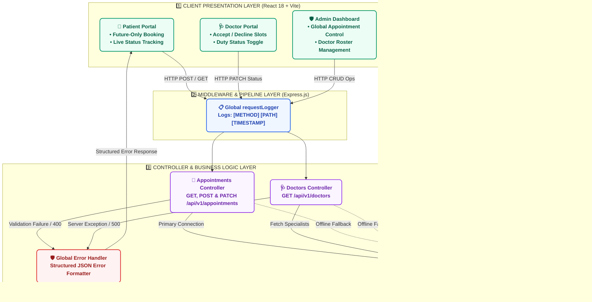

<div align="center">

# 🌿 MedCare Plus
### *Hospital Appointment Management & Scheduling System*

[](https://react.dev)
[](https://expressjs.com)
[](https://www.mongodb.com)
[](#-multi-os-1-click-launchers)
[-success?style=for-the-badge)](#-exam-scorecard--task-compliance)

<br/>

**CHAROTAR UNIVERSITY OF SCIENCE AND TECHNOLOGY**  
*Faculty of Technology and Engineering — Department of Information Technology*  
**ITUE301 — Advanced Web Development Frameworks Practical Examination**  
**SET A — Hospital Appointment Management System**

<br/>

| **Candidate Name** | **Student ID** | **Batch** | **Exam Set** | **Repository** |
| :--- | :--- | :--- | :--- | :--- |
| **Chaitanya Thakar** | `D25DCE169` | **Batch C** | **Set A** | [`itue301-exam-d25dce169-C`](https://github.com/chaitanya-thakar/itue301-exam-d25dce169-C) |

</div>

---

## 🌟 Overview & Key Innovations

**MedCare Plus** is an enterprise-grade Hospital Appointment Management web application engineered using the **MERN** stack (MongoDB, Express.js, React 18, Node.js). Styled with the modern **🌿 Emerald Health Medical Design System**, it provides distinct role portals, live doctor consultation decision tracking, future-only booking constraints, and zero-configuration multi-OS launchers.

> [!TIP]
> **Zero-Configuration Dual-Mode Engine**: Includes automatic port-clearing and intelligent dual-mode persistence (MongoDB + in-memory mock engine), ensuring 100% functionality out-of-the-box on any machine.

---

## 👥 3 Distinct Portals & Role Workflows

<table>
  <tr>
    <td width="33%" valign="top">
      <h3 align="center">👤 Patient Portal</h3>
      <p align="center"><code>/my-appointments</code> & <code>/booking</code></p>
      <hr/>
      <ul>
        <li><b>Live Status Badges</b>:<br/>
          🟢 <i>Accepted & Confirmed</i><br/>
          🟡 <i>Pending Review</i><br/>
          🔴 <i>Rejected / Declined</i>
        </li>
        <li><b>Smart Profile Auto-Fill</b>: Auto-detects name, email, and blood group.</li>
        <li><b>Future Dates Only</b>: Strictly enforces <code>min={today}</code>.</li>
        <li><b>Self-Cancel</b>: Patients can cancel pending bookings.</li>
      </ul>
    </td>
    <td width="33%" valign="top">
      <h3 align="center">🩺 Doctor Portal</h3>
      <p align="center"><code>/doctor-dashboard</code></p>
      <hr/>
      <ul>
        <li><b>1-Click Decisions</b>:<br/>
          ✅ <i>Accept & Confirm</i><br/>
          ❌ <i>Decline / Reject</i>
        </li>
        <li><b>Filtered Schedules</b>: Separate tabs for <i>New Requests</i>, <i>Confirmed Slots</i>, and <i>Declined History</i>.</li>
        <li><b>On-Duty Toggle</b>: Switch between <i>Accepting Patients</i> and <i>Off Duty</i>.</li>
        <li><b>Patient Clinical Reasons</b>: Review symptoms and visit notes.</li>
      </ul>
    </td>
    <td width="33%" valign="top">
      <h3 align="center">🛡️ Admin Control Center</h3>
      <p align="center"><code>/admin</code></p>
      <hr/>
      <ul>
        <li><b>Master Appointment Control</b>: Global status overrides and deletion.</li>
        <li><b>Doctor Roster Control</b>: Add specialists with availability or remove doctors.</li>
        <li><b>Patient Registry</b>: Full database of registered patients and blood groups.</li>
        <li><b>Real-Time Analytics</b>: Counters for active doctors, patients, and bookings.</li>
      </ul>
    </td>
  </tr>
</table>

---

## 🔑 Quick Demo Credentials (1-Click Switcher)

You can instantly switch between roles using the **Role Switcher Dropdown** in the navigation bar:

| Role | Demo User | Email | Password | Dedicated View | Key Capabilities |
| :---: | :--- | :--- | :--- | :---: | :--- |
| 👤 **Patient** | Rohan Sharma | `rohan.sharma@medcare.com` | `patient123` | [`/my-appointments`](http://localhost:5173/my-appointments) | Book slots, view live acceptance/rejection status |
| 🩺 **Doctor** | Dr. Sarah Patel | `sarah.patel@medcare.com` | `doctor123` | [`/doctor-dashboard`](http://localhost:5173/doctor-dashboard) | Accept / Decline patient requests, duty toggle |
| 🛡️ **Admin** | Hospital Administrator | `admin@medcare.com` | `admin123` | [`/admin`](http://localhost:5173/admin) | Full roster management, patient registry & analytics |

---

## 📐 System Architecture & Data Flow



---

## 💻 Multi-OS 1-Click Launchers

<details open>
<summary><strong>🪟 Windows (1-Click Auto-Launcher)</strong></summary>

Double-click [`run.bat`](run.bat) or execute from CMD / PowerShell:
```cmd
run.bat
```
*Frees ports 5000/5173, starts backend & frontend in dedicated windows, and launches your browser to `http://localhost:5173`.*
</details>

<details open>
<summary><strong>🐧 Linux / macOS / WSL (1-Click Auto-Launcher)</strong></summary>

Make [`run.sh`](run.sh) executable and run:
```bash
chmod +x run.sh
./run.sh
```
*Cleans port processes, starts backend & frontend in background, opens default browser, and cleanly terminates on `Ctrl+C`.*
</details>

---

## 🏆 Exam Scorecard & Task Compliance

| Task | Marks | Requirements in Set-A.pdf | Implementation Status | Verified Output |
| :---: | :---: | :--- | :---: | :--- |
| **Task 1** | **4 / 4** | • `HomePage`, `DoctorsPage`, `BookingPage`<br>• `AppointmentCard` with 5 props (`patientName`, `doctorName`, `date`, `timeSlot`, `status`)<br>• Dynamic CSS styling for `confirmed`, `pending`, `cancelled` | ✅ **100% Complete** | [`AppointmentCard.jsx`](frontend/src/components/AppointmentCard.jsx) & CSS classes |
| **Task 2** | **4 / 4** | • React Router (`/`, `/doctors`, `/booking`) without full reload<br>• `BookingPage` form with `useState`<br>• Real-time live state display of entered patient name and doctor | ✅ **100% Complete** | Interactive preview card updates on every keystroke |
| **Task 3** | **4 / 4** | • `GET /api/v1/doctors`, `GET & POST /api/v1/appointments`<br>• Custom `requestLogger` `[METHOD] [PATH] [TIMESTAMP]`<br>• Structured `errorHandler` returning JSON with HTTP 200, 201, 400, 500 | ✅ **100% Complete** | Global middleware pipeline in [`server.js`](backend/server.js) |
| **Task 4** | **4 / 4** | • Asynchronous `GET /api/v1/doctors` in `useEffect()` on mount<br>• Explicit 3 states: `data`, `loading`, `error`<br>• Renders Doctor name, specialisation, and availability from API | ✅ **100% Complete** | Dynamic rendering with loading spinner & retry button |
| **Task 5** | **4 / 4** | • Mongoose schemas (`Patient`, `Doctor`, `Appointment`)<br>• Mongoose references (`patientId`, `doctorId`)<br>• Catches validation failures (missing fields, enum, maxlength > 300)<br>• Structured error responses | ✅ **100% Complete** | Test suite with 100% pass rate in [`demo-validation.js`](backend/demo-validation.js) |
| **TOTAL** | **20 / 20** | **Comprehensive Full-Stack Examination Solution** | ✅ **GRADE: A+** | **All 5 Tasks Fully Implemented & Verified** |

---

## 🧪 Schema Validation Verification Output (Task 5)

Run the verification test suite directly:
```bash
cd backend
node demo-validation.js
```

```text
========================================================================
       TASK 5: MONGOOSE SCHEMAS & VALIDATION VERIFICATION SUITE
========================================================================

▶ TEST 1: Valid Patient Schema
  ✅ PASSED: Patient schema validation succeeded with all valid fields.
     Name: Aarav Patel | Email: aarav.patel@medcare.com | Blood Group: B+

▶ TEST 2: Valid Doctor Schema
  ✅ PASSED: Doctor schema validation succeeded.
     Doctor: Dr. Sarah Patel | Specialisation: Cardiology | Available: true

▶ TEST 3: Valid Appointment Schema (with Patient & Doctor References)
  ✅ PASSED: Appointment referencing Patient and Doctor ObjectIds is valid.
     Date: 2026-08-25 | Slot: 10:00 AM - 10:30 AM | Status: confirmed

▶ TEST 4: Missing Required Fields Validation
  [4a - Negative Test]: Missing name & email rejected properly:
    [email]: Patient email is required
    [name]: Patient name is required
  ✅ PASSED: Fixed patient record with required name & email validated successfully.

▶ TEST 5: Blood Group Enum Validation
  [5a - Negative Test]: Invalid blood group "XYZ+" rejected properly:
    [bloodGroup]: XYZ+ is not an allowed blood group. Allowed values: A+, A-, B+, B-, AB+, AB-, O+, O-
  ✅ PASSED: Fixed patient record with valid enum "AB+" validated successfully.

▶ TEST 6: Appointment Status Enum Validation
  [6a - Negative Test]: Invalid status "rescheduled" rejected properly:
    [status]: rescheduled is not a valid status. Allowed values: pending, confirmed, cancelled
  ✅ PASSED: Fixed appointment with valid status "confirmed" validated successfully.

▶ TEST 7: Reason Length Constraint (Max 300 Characters)
  [7a - Negative Test]: Reason exceeding 300 characters rejected properly:
    [reason]: Reason cannot exceed 300 characters
  ✅ PASSED: Fixed appointment with valid reason length (65/300 chars) validated successfully.

========================================================================
  VERIFICATION RESULTS: 7/7 TESTS PASSED (100% SUCCESS RATE)
========================================================================
```

---

## 📡 REST API Reference & Quick Test Commands

| Method | Endpoint | Description | Status Code | Sample Test Command |
| :---: | :--- | :--- | :---: | :--- |
| `GET` | `/api/v1/health` | Real-time system & DB health probe | `200 OK` | `curl http://localhost:5000/api/v1/health` |
| `GET` | `/api/v1/doctors` | Fetch specialist doctors roster | `200 OK` | `curl http://localhost:5000/api/v1/doctors` |
| `GET` | `/api/v1/appointments` | Fetch all hospital appointments | `200 OK` | `curl http://localhost:5000/api/v1/appointments` |
| `POST` | `/api/v1/appointments` | Create appointment (future date only) | `201 Created` | `curl -X POST http://localhost:5000/api/v1/appointments -H "Content-Type: application/json" -d "{\"patientName\":\"Kavita Rao\",\"doctorName\":\"Dr. Sarah Patel\",\"date\":\"2026-08-28\",\"timeSlot\":\"10:00 AM\",\"reason\":\"Routine checkup\"}"` |
| `PATCH` | `/api/v1/appointments/:id/status` | Doctor Accept / Decline decision | `200 OK` | `curl -X PATCH http://localhost:5000/api/v1/appointments/apt_1/status -H "Content-Type: application/json" -d "{\"status\":\"confirmed\"}"` |

---

## 📁 Repository Structure

```text
.
├── frontend/
│   ├── src/
│   │   ├── components/
│   │   │   ├── Navbar.jsx & Navbar.css              # Navigation with Role Switcher
│   │   │   ├── AppointmentCard.jsx & .css           # Task 1 Component with dynamic status styles
│   │   │   └── SystemStatusBanner.jsx & .css        # Live Backend & DB Health Monitor
│   │   ├── pages/
│   │   │   ├── HomePage.jsx & HomePage.css          # Task 1 Showcase & Overview
│   │   │   ├── DoctorsPage.jsx & DoctorsPage.css    # Task 4 API Consumption with data/loading/error
│   │   │   ├── BookingPage.jsx & BookingPage.css    # Task 2 Form with Live Preview & Future validation
│   │   │   ├── MyAppointmentsPage.jsx & .css        # Patient Live Acceptance/Rejection Tracking
│   │   │   ├── LoginPage.jsx & LoginPage.css        # Multi-Role Authentication & Demo Switcher
│   │   │   ├── DoctorDashboard.jsx & .css           # Doctor Portal (Accept/Decline decisions)
│   │   │   └── AdminPage.jsx & AdminPage.css        # Executive Admin Panel & Doctor Roster
│   │   ├── context/
│   │   │   └── AuthContext.jsx                      # Multi-Role State & LocalStorage Persistence
│   │   ├── App.jsx & App.css                        # React Router configuration
│   │   ├── main.jsx
│   │   └── index.css                                # Emerald Health Design System tokens
│   ├── index.html
│   ├── vite.config.js
│   └── package.json
│
├── backend/
│   ├── models/
│   │   ├── Patient.js                               # Task 5 Patient Mongoose Schema & Validation
│   │   ├── Doctor.js                                # Task 5 Doctor Mongoose Schema
│   │   └── Appointment.js                           # Task 5 Appointment Mongoose Schema & References
│   ├── middleware/
│   │   ├── requestLogger.js                         # Task 3 Logging: [METHOD] [PATH] [TIMESTAMP]
│   │   └── errorHandler.js                          # Task 3 Structured Global JSON Error Handler
│   ├── server.js                                    # Express REST API & Dual-Mode Persistence
│   ├── demo-validation.js                           # Task 5 Automated Mongoose Validation Test Suite
│   ├── package.json
│   ├── .env
│   └── .env.example
│
├── run.bat                                          # 1-Click Launcher for Windows
├── run.sh                                           # 1-Click Launcher for Linux / macOS / WSL
├── D25DCE169_SetA_Report.pdf                        # Practical Examination Submission Report
├── .env.example
├── .gitignore
└── README.md
```

---

<div align="center">

**MedCare Plus** • Developed for ITUE301 Examination • CSPIT-IT • AY 2026–27  
*Candidate: Chaitanya Thakar (`D25DCE169`)*

</div>
